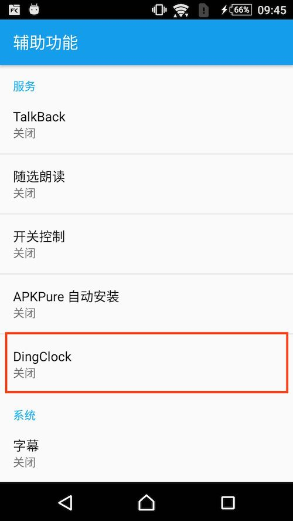
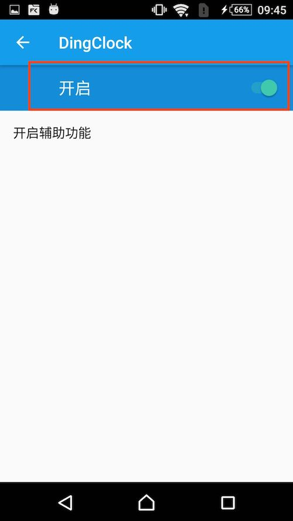
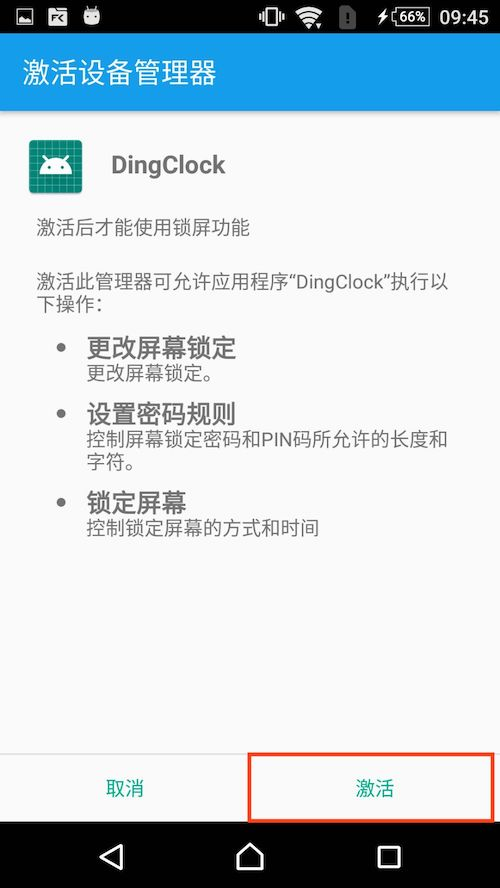

# DingClock
无需root的钉钉自动打卡程序，在设置好的四个时间点每天自动打开钉钉进行打卡
使用AlarmManager实现的定时调起程序，AccessibilityService实现的模拟打卡操作

**尚不稳定，只是写来玩的，不定期更新...**

sony z3 android 6.1 上测试通过 原生系统基本没啥问题

oppo r9 android 5.1 上测试通过，但是遇到辅助功能呢的设置偶尔会被莫名其妙重置问题，暂时放弃

红米 redmi6 android 8.1 上测试通过 需要手动修改开发者模式：开启【直接进入系统】，需要修改程序权限：允许后台弹出，关闭省电模式

需要一个不用的手机，扔在单位，登陆钉钉

## 使用方法：
1. 打开程序会提示开启辅助功能（用于调起其他app自动打卡）与设备管理功能（用于息屏及点亮屏幕），这俩功能必须开启

2. 进入程序，点击'测试'，可以先试试能不能打卡
3. 点击'启动闹钟'，程序会在设置的时间点自动打开钉钉进行打卡
4. 安装qq，登陆qq小号，对小号发送1 可以进行远程打卡，目前还没有日志回传功能

## 卸载
卸载程序时会要求先从 设备管理功能 关闭此程序，关闭后即可卸载

## 注意事项
**程序打卡期间最好别操作手机，会影响程序打卡流程，如果已经打断了打卡，重新点击'启动闹钟'可以重置，下次自动打卡就正常了**

**钉钉平时应停留在非'工作'页面**

**如果钉钉无法跳转到打卡页面彻底关掉钉钉重启即可**

**带锁屏画布功能手机，需要在开发者模式中关闭锁屏画布，小米手机开启【直接进入系统】，其他手机不清楚**

**如有异常可以关闭程序的省电优化，并允许程序从后台弹出。**
